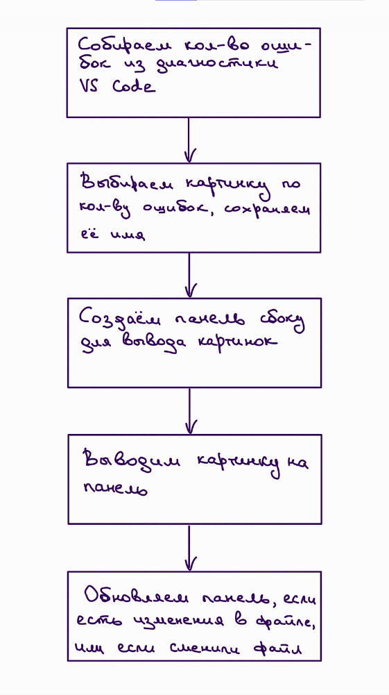

# Отчёт по лабороторной работе №3

### ТЗ:

- Создать плагин для VS Code, который показывает разные картинки с котиками, в зависимости от того сколько ошибок в коде у пользователя

- Должны быть разные картинки для 0, 1, 2, 3, 4, от 5 до 10, от 10 и больше ошибок  
### Архитектура плагина:  

  

- Код плагина в файле ```extension.js``` и конфигурационный файл ```package.json``` находятся на Github по ссылке ```https://github.com/katnaws/isrpo_lab3.git```  
- Документация по проекту в файле `README.md` также находится на Github

  